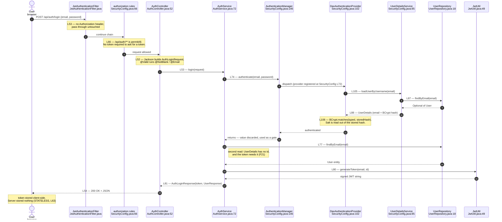
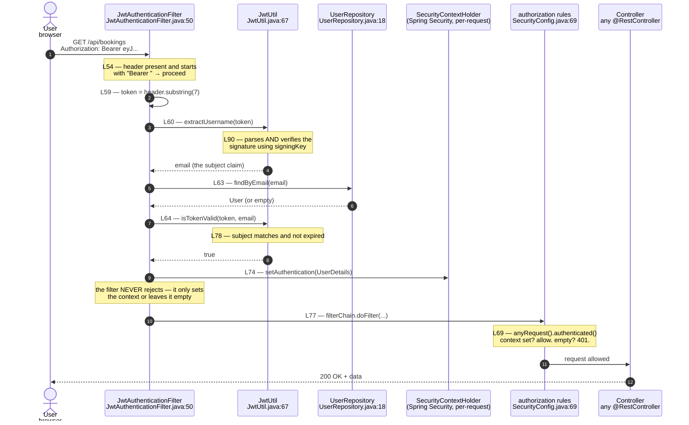
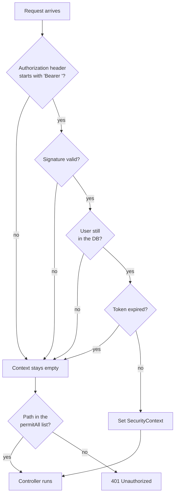

# Auth flow — sequence diagrams

Rendered by GitHub, VS Code (Markdown Preview Mermaid), and mermaid.live.
Export to PNG from mermaid.live for the slides.

---

## 1. Login — the token is created

---

## 2. Any request after login — the token is verified

---

## 3. The decision points — where a request dies

---

## Reading these

Three ideas the diagrams are meant to make obvious:

1. **The filter never rejects.** It sets the context or leaves it empty.
   Rejection is a separate, later step in `SecurityConfig`.
   *Filter = who are you. Config = are you allowed.*

2. **`permitAll` exists because of a chicken-and-egg problem.**
   The default rule demands a token; the login endpoint is where you get one.

3. **Two database reads happen at login.** One inside the provider to verify
   the password, one in the service to get the `id` for the token.
   See finding F21.
