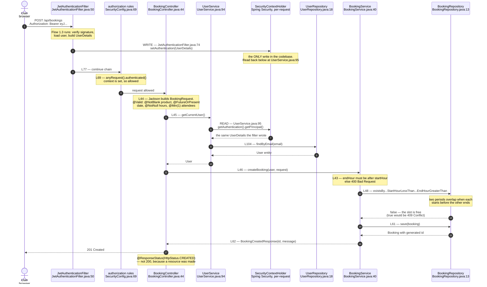
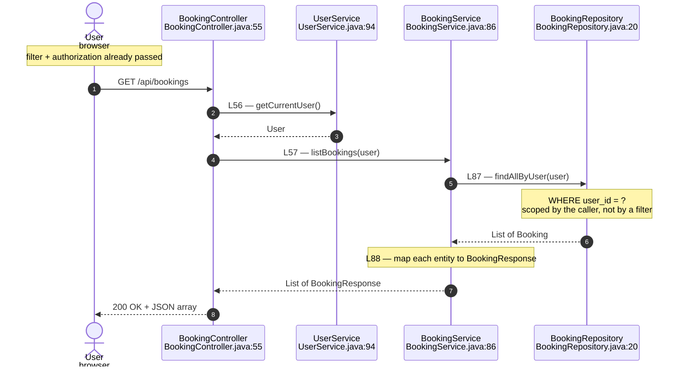
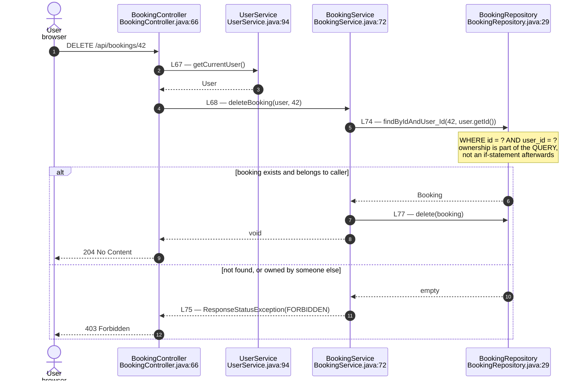

# Flow 2 — Booking

Three endpoints, all under `/api/bookings`, all requiring a valid token.
This is the first flow that runs *after* authentication, so every diagram
below starts where Flow 1.3 ended: with the security context populated.

---

## 1. Create a booking

---

## 2. List my bookings

---

## 3. Delete a booking — the authorization step

---

## What these diagrams are meant to show

**Authentication is invisible here, and that is the point.** No booking file
mentions tokens, headers or signatures. The filter did that work already, and
`getCurrentUser()` reads the result. Flow 1 exists so Flow 2 can ignore it.

**Ownership is enforced in the query, not after it.** `findByIdAndUser_Id`
means a booking belonging to another user is never loaded in the first place.
The alternative — load by id, then `if (!booking.getUser().equals(user))` —
is one forgotten `if` away from letting anyone delete anything.

**Identity is written once and read once.** The filter writes to
`SecurityContextHolder` at `JwtAuthenticationFilter.java:74`; `UserService.java:95`
reads it back. That single write and single read are the only reason a booking
knows who made it — nothing in `BookingRequest` carries a user.

**Validation happens at two layers, answering two questions.** `@Valid` on the DTO
asks whether each field is well-formed. `BookingService` asks whether the fields
make sense together (`endHour` after `startHour`) and against what is already
stored (no overlapping booking). Bean Validation cannot answer the second kind.
