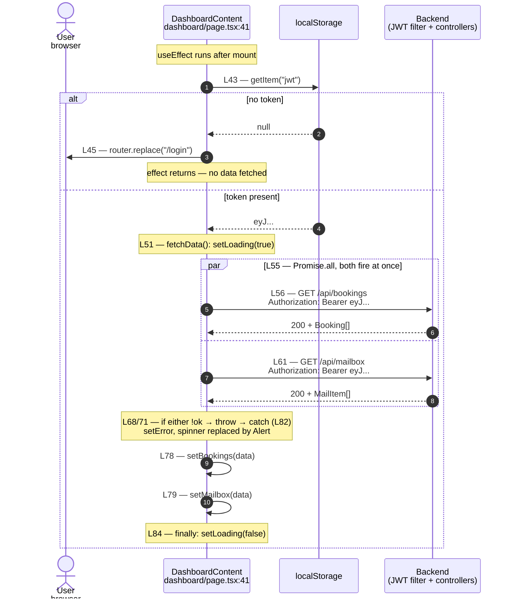
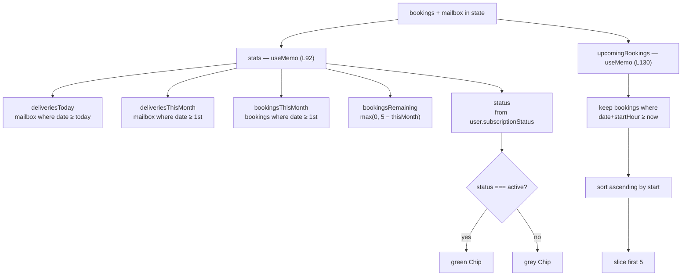

# Flow 4 — Dashboard load

The dashboard is a *client-orchestrated* flow: no dashboard endpoint exists on the
backend. The page (`frontend/src/app/dashboard/page.tsx`) checks for a token, then
fans out to the two feature endpoints it already knows — `/bookings` and `/mailbox` —
and does all the aggregation (stats, "upcoming") itself, in the browser.

Rendered by GitHub, VS Code (Markdown Preview Mermaid), and mermaid.live.
Export to PNG from mermaid.live for the slides.

---

## 1. Loading the overview — two calls in parallel

---

## 2. What the browser computes from the two lists

---

## What these diagrams are meant to show

**There is no dashboard endpoint.** The "dashboard" is a composition, not a
resource. It reuses `/bookings` and `/mailbox` and joins them on the client. That
is why nothing in the backend mentions a dashboard — the page *is* the join.

**The two calls are parallel, not sequential.** `Promise.all` at L55 fires both
requests together, so the slower of the two sets the wait — not their sum. Either
failing rejects the whole `Promise.all` and drops into one `catch`.

**The gate is the token, checked before any fetch.** L43–45 redirect to `/login`
when no `jwt` is present, so an unauthenticated user never even issues the two
requests. The backend would reject them anyway (401) — this is the UX half of the
same rule.

**Every number on the screen is derived, not stored.** "Bookings remaining",
"deliveries today", "upcoming" are all `useMemo` computations over the two raw
lists (L92, L130). The backend stores bookings and mail; the *counts* live only
in the browser and recompute when their inputs change.
