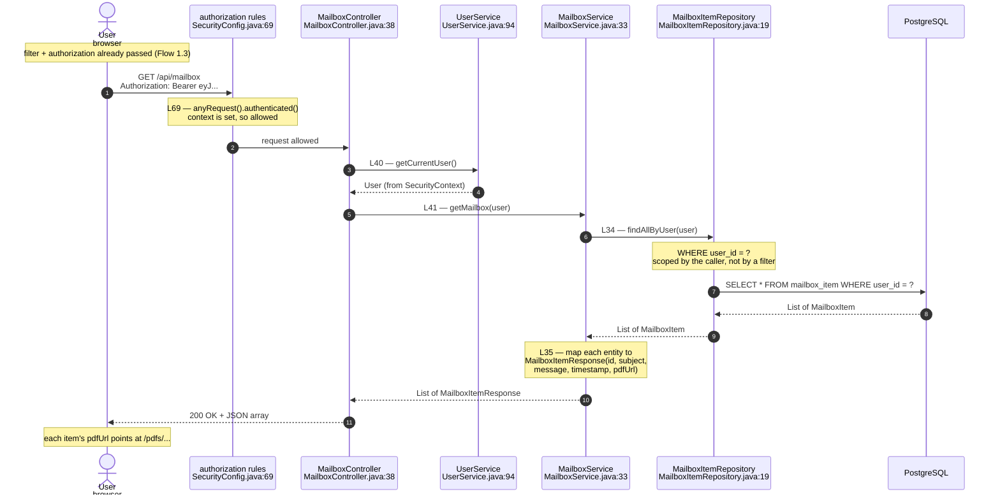
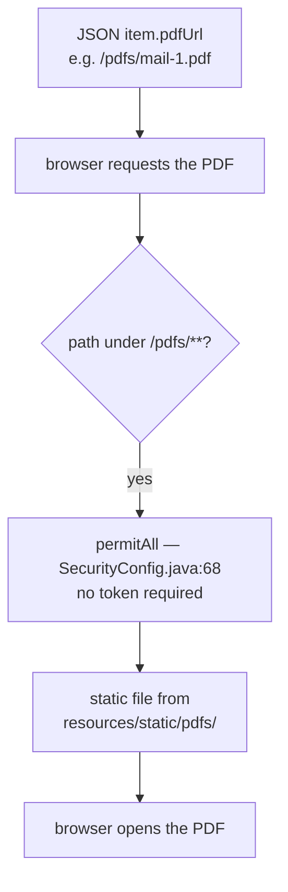

# Flow 5 — Mailbox

One endpoint, `GET /api/mailbox`, requiring a valid token. It is the simplest
feature flow in the codebase — no request body, no validation, no writes — and it
exists mainly to show two things: ownership scoping in the query, and how the PDF
attachments are served outside the JSON.

Rendered by GitHub, VS Code (Markdown Preview Mermaid), and mermaid.live.
Export to PNG from mermaid.live for the slides.

---

## 1. List my mailbox items

---

## 2. Opening an attachment — served outside the JSON

---

## What these diagrams are meant to show

**Ownership is in the query, exactly like bookings.** `findAllByUser(user)` means
another user's mail is never loaded — the scoping is the `WHERE user_id = ?`, not a
check afterwards. Same pattern as `findByIdAndUser_Id` in the booking delete flow.

**The entity never leaves the service.** `MailboxItem` (a JPA entity) is mapped to
`MailboxItemResponse` (a DTO) at `MailboxService.java:35` before returning. The API
exposes a chosen shape — id, subject, message, timestamp, pdfUrl — not the raw table.

**The PDF is a separate, public request.** The JSON carries only a `pdfUrl` string.
The file itself is fetched afterwards from `/pdfs/**`, which is `permitAll`
(`SecurityConfig.java:68`) — a static resource, not an authenticated API call. The
list is private; the attachment bytes are served like any other static asset.

**This is the read-only baseline.** No POST, no `@Valid`, no overlap check — mailbox
is the control case that makes the booking flow's extra machinery (validation,
conflict detection, 201 vs 200) easy to see by contrast.
