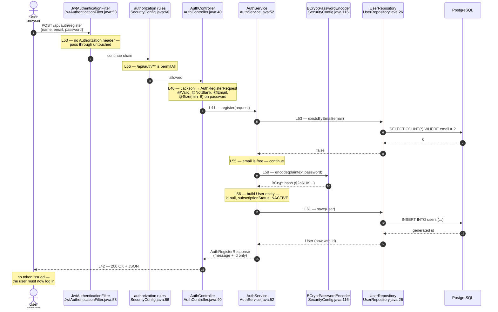
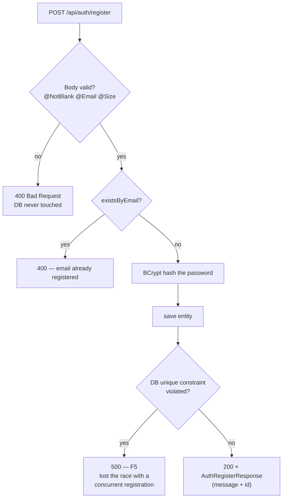

# Flow 1.1 — Registration

## The happy path

## Where registration can fail

## Two things the diagram is meant to make obvious

**No token is issued.** Registration ends with a user row, nothing more.
The user has to log in as a separate step. Compare with the login diagram,
where the whole point is producing a token.

**The plaintext password exists for exactly one hop** — from the DTO into
`encode()`. After that only the hash exists, and `AuthRegisterResponse` carries
nothing but a message and the new id — there is no field either one could
travel back out in.
