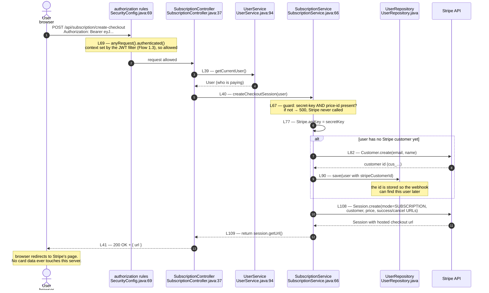
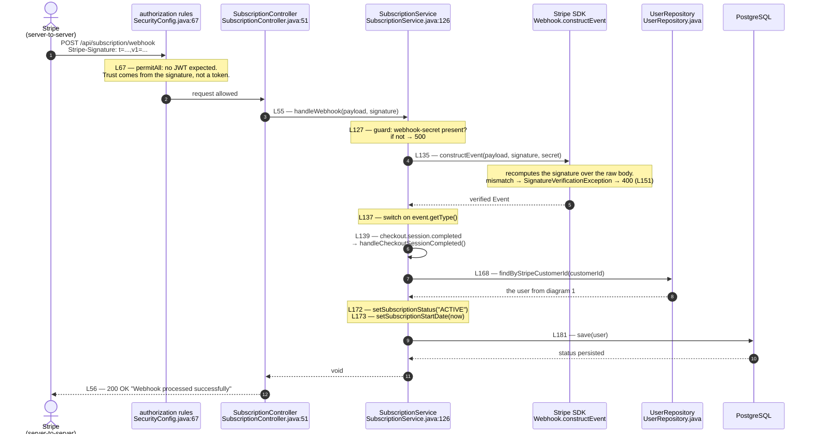
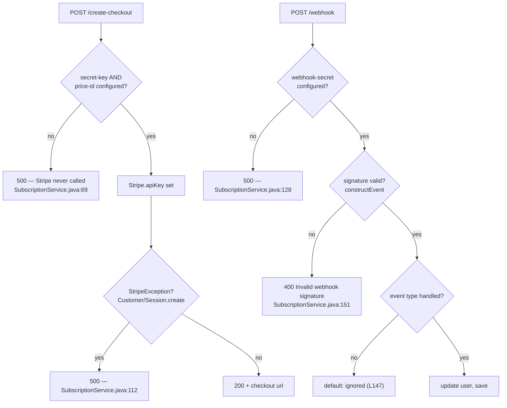

# Flow 3 — Subscription (Stripe)

Two endpoints under `/api/subscription`. They are authorized in opposite ways:
`/create-checkout` needs a token like every other feature; `/webhook` is public
(`SecurityConfig.java:67` permitAll) because the caller is Stripe, not the user —
it carries no JWT and proves itself with a signature instead.

Rendered by GitHub, VS Code (Markdown Preview Mermaid), and mermaid.live.
Export to PNG from mermaid.live for the slides.

---

## 1. Creating the checkout session — the user starts paying

---

## 2. The webhook — Stripe reports the payment, we flip the status

---

## 3. Where the payment flow can fail

---

## What these diagrams are meant to show

**The activation is not the click — it is the webhook.** Diagram 1 only sends
the user to Stripe and returns a URL. The account is still `INACTIVE` at that
point. Status flips to `ACTIVE` only in diagram 2, when Stripe calls *us* back.
The two halves are connected by one value: the `stripeCustomerId` saved at
`SubscriptionService.java:90` and read back at `:168`.

**The webhook is public on purpose, but not unprotected.** It is the one endpoint
past the JWT wall (`SecurityConfig.java:67`) because Stripe has no token. The wall
is replaced, not removed: `constructEvent` recomputes the signature over the raw
body and rejects a forgery with 400. permitAll here means "no JWT", not "no check".

**No card data touches this server.** The card is entered on Stripe's hosted page
in diagram 1. This backend only ever holds Stripe *identifiers* (`cus_...`,
`sub_...`) and a status string — never a PAN. That is the whole reason to redirect
rather than collect payment ourselves.

**Missing configuration fails loudly, not silently.** Both entry points guard on
their secrets first (`:67`, `:127`) and return 500 rather than half-run. With no
Stripe keys the feature is simply off — every other feature keeps working, which
is why the keys are optional in `.env`.
